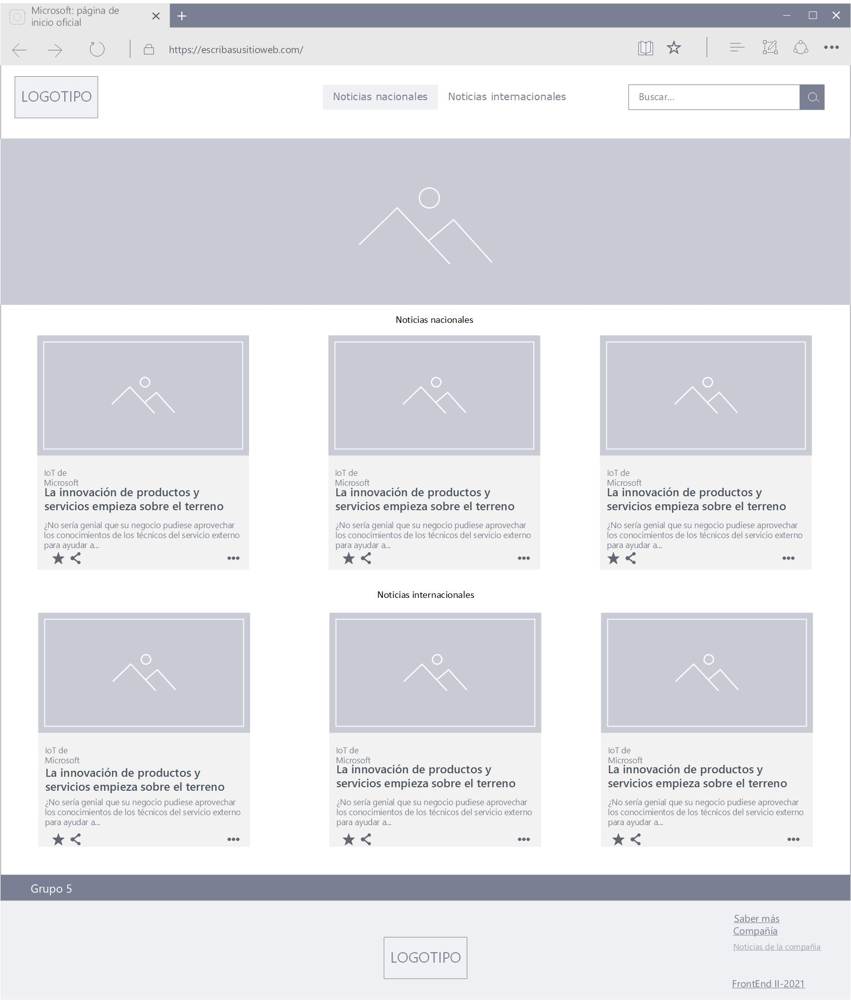

# Sitio de noticias

En esta práctica, deberán resolver como equipo el siguiente desafío que consta de 4
requerimientos principales. Por lo cual deberá recurrir a la división de tareas para lograr resolver
el mismo dentro de los tiempos fijados.
# Consignas
Deberán crear un sitio de noticias desde 0. El mismo debe respetar las siguientes indicaciones:

# Requerimiento N° 1

El sitio debe estar previamente maquetado en un wireframe, pueden utilizar cualquier
herramienta para esto ( Figma / Adobe XD / Paint / etc). Incluso un dibujo en papel. El sitio debe
tener 3 secciones principales, un header, un main donde estarán las noticias y un footer.
Internamente en cada sección tienen libertad para la creación de sus componentes.

# Requerimiento N° 2

El html y el css deben reflejar lo estipulado en el boceto, los estilos pueden variar, pero el
wireframe y el resultado final no pueden ser 2 cosas distintas. Buscamos la coherencia entre lo
planificado y lo desarrollado, sino el primer requerimiento no tendría sentido.