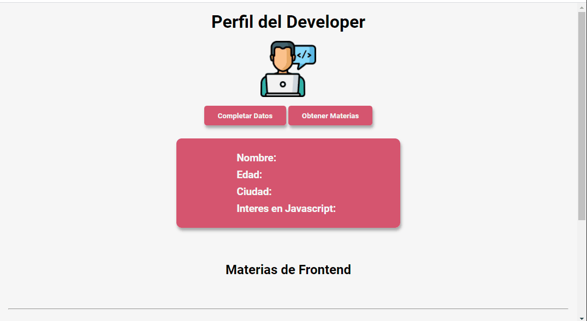

# Entregable - Consignas. ✏️
Primero que nada, deberán descargar la plantilla de archivos .zip que se encuentran
en la misma carpeta que este documento. Luego, es fundamental que lean
atentamente todas las consignas antes de comenzar a desarrollar sus soluciones.
Una idea general del resultado buscado es clave para cumplir los requerimientos. Les
dejamos esta pequeña ayuda: 

Solo deberán crear código Javascript en el archivo code.js, puntualmente en los
espacios marcados dentro de las funciones establecidas.

Bajo ninguna circunstancia modifiquen el resto de los archivos. Obviamente
pueden revisar tanto el HMTL como el CSS, pero no se debe realizar cambio alguno ya
que no impactarán en la corrección del proyecto. Solo se evaluará el código JavaScript
por parte de los profesores a la hora de corregir.
NO AGREGAR COMENTARIOS EN LÍNEA EN EL code.js, AL MOMENTO DE
ENTREGAR CONTROLAR QUE NO HAYA COMENTARIOS AGREGADOS.